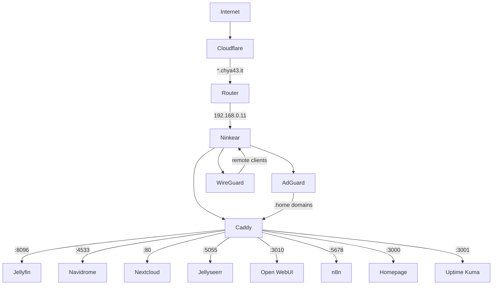
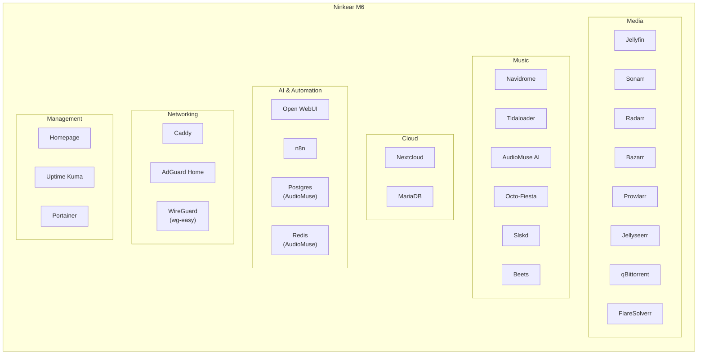
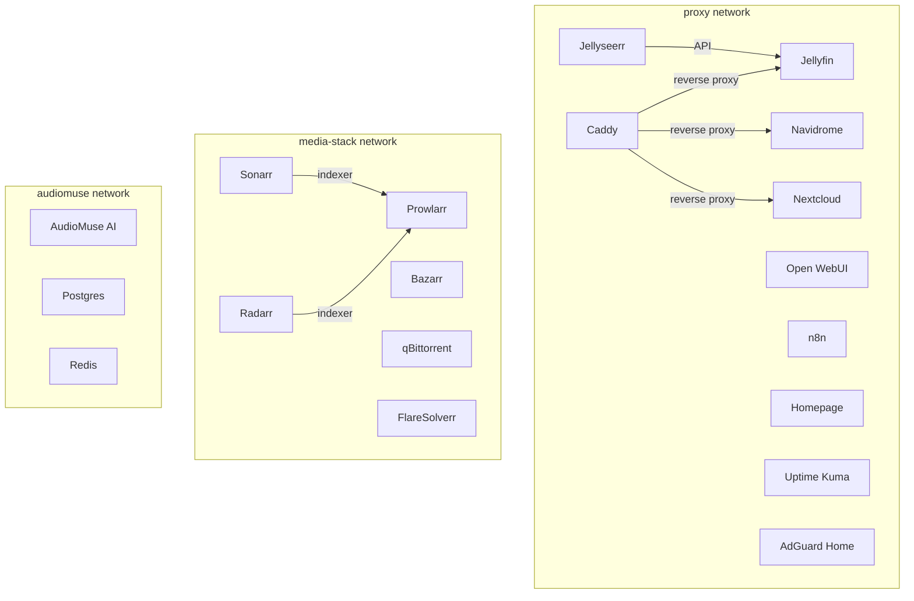

# Overview
 
The homelab runs entirely on a **Ninkear M6** mini PC, with Ubuntu 24.04 and Docker Compose as the orchestrator.
 
## Network Flow
 

 
## Services by Category
 

 
## Docker Network Layout
 

 
## Sections
 
- [Hardware](hardware.md) — server and workstation specs
- [Services](services.md) — full list of all containers with ports and descriptions
- [Networking](networking.md) — Caddy, AdGuard, WireGuard, Docker networks
