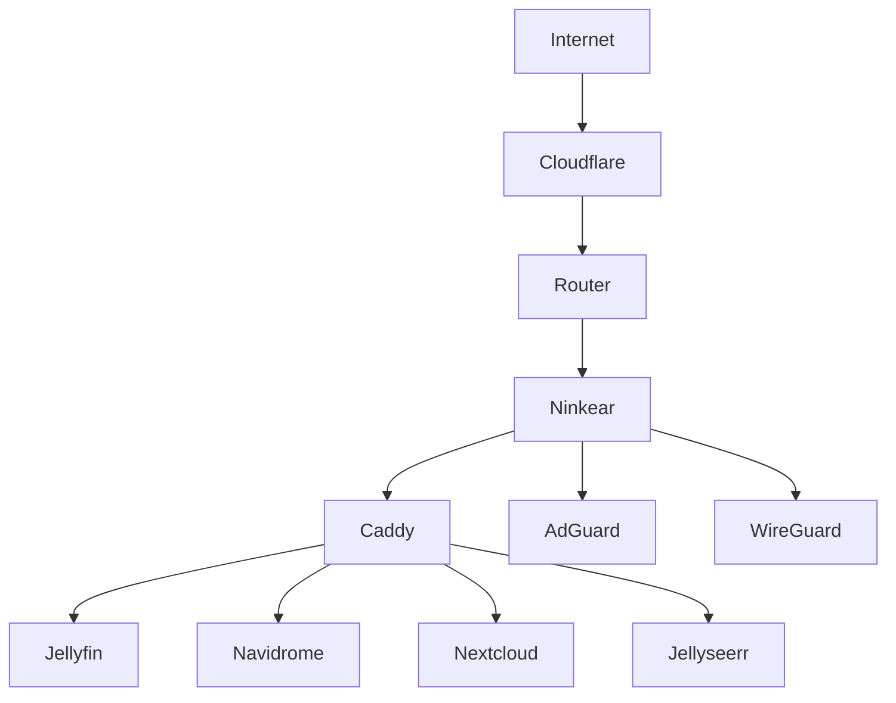

# Overview

The homelab runs entirely on a **Ninkear M6** mini PC, with Ubuntu 24.04 and Docker Compose as the orchestrator.

## Stack at a Glance


```
┌─────────────────────────────────────────────┐
│              Ninkear M6                      │
│                                             │
│  ┌──────────┐  ┌──────────┐  ┌──────────┐  │
│  │  Media   │  │  Music   │  │  Cloud   │  │
│  │ Jellyfin │  │Navidrome │  │Nextcloud │  │
│  │  Sonarr  │  │AudioMuse │  │          │  │
│  │  Radarr  │  │  Slskd   │  └──────────┘  │
│  └──────────┘  └──────────┘                │
│                                             │
│  ┌──────────┐  ┌──────────┐  ┌──────────┐  │
│  │    AI    │  │ Network  │  │  Mgmt    │  │
│  │Open WebUI│  │  Caddy   │  │Homepage  │  │
│  │   n8n    │  │AdGuard   │  │Portainer │  │
│  │          │  │WireGuard │  │Uptime K. │  │
│  └──────────┘  └──────────┘  └──────────┘  │
└─────────────────────────────────────────────┘
```

## Sections

- [Hardware](hardware.md) — server and workstation specs
- [Services](services.md) — full list of all containers with ports and descriptions
- [Networking](networking.md) — Caddy, AdGuard, WireGuard, Docker networks
